# API Sequence Diagrams

Below are sequence diagrams for each implemented API route, showing the flow from frontend to backend and database/AI as appropriate.

---

## Authentication

### `/api/auth/register` (User Registration)
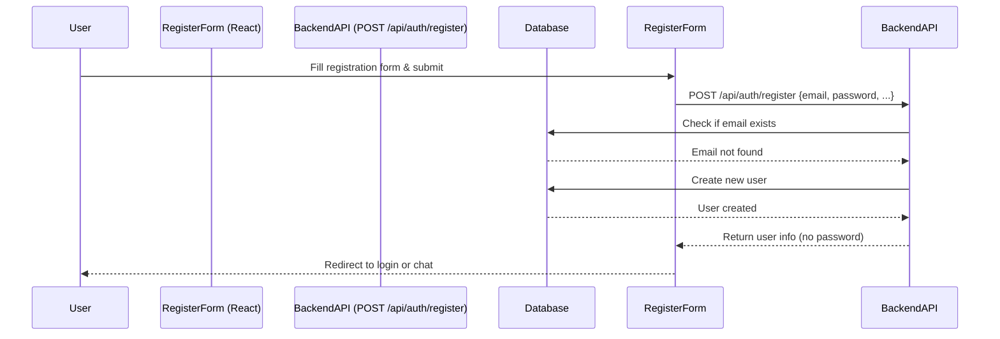

### `/api/auth/token` (Login)
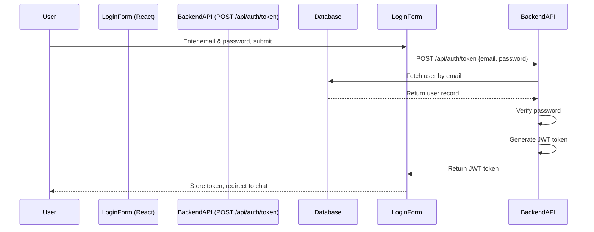

### `/api/auth/me` (Get Current User)
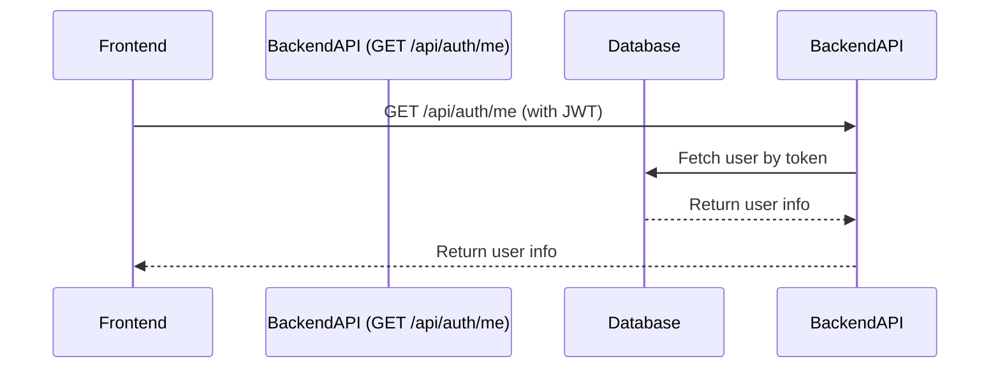

---

## Chat

### `/api/chat` (Send Message)
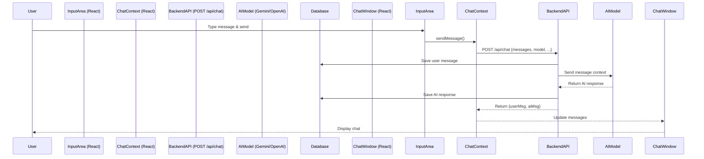

### `/api/chat/thread` (Chat with Thread Context)
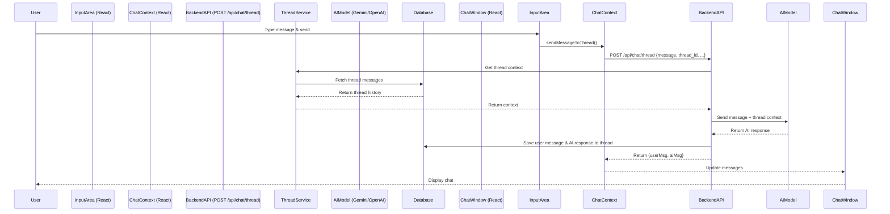

---

## Threads

### `/api/threads` (Create Thread)
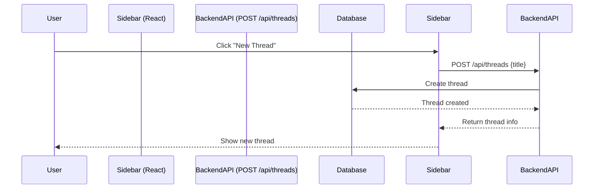

### `/api/threads` (List Threads)
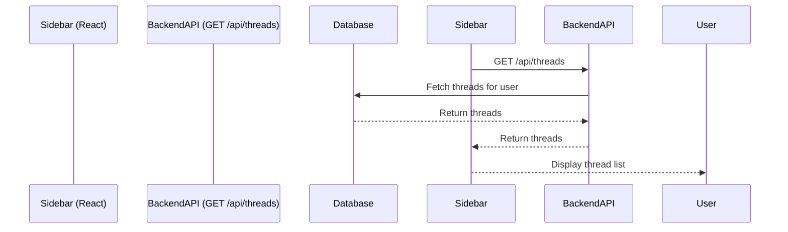

### `/api/threads/{id}` (Get Thread Messages)
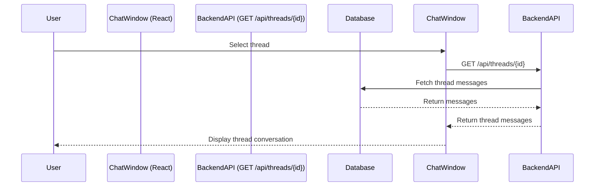

### `/api/threads/{id}` (Update Thread Title)
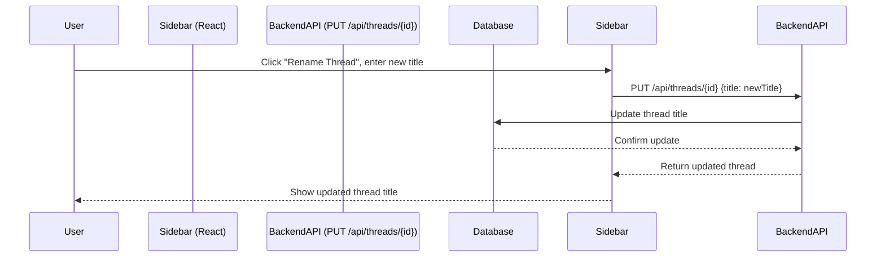

### `/api/threads/{id}` (Delete Thread)
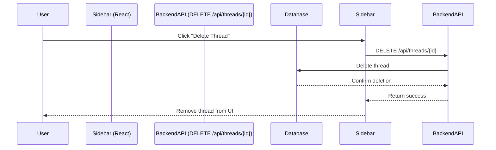

---

## Models

### `/api/models` (List Available AI Models)
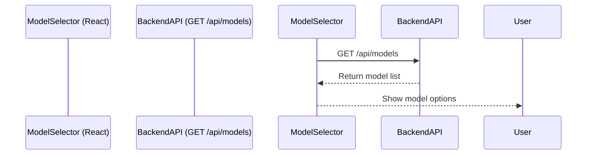

---

## Rate Limits

### `/api/rate-limits` (Get Rate Limit Status)
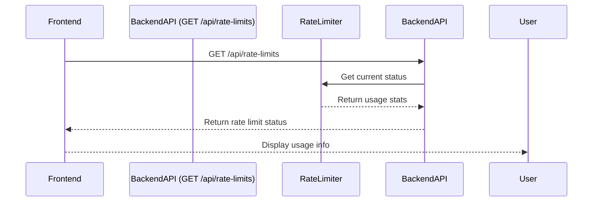

---

> **Note:**  
> - File upload/management routes are not yet implemented
> - Thread editing functionality is not yet implemented
> - You can view these diagrams rendered in [Mermaid Live Editor](https://mermaid.live/) or in markdown viewers that support Mermaid (e.g., GitHub, VS Code with Mermaid plugin) 